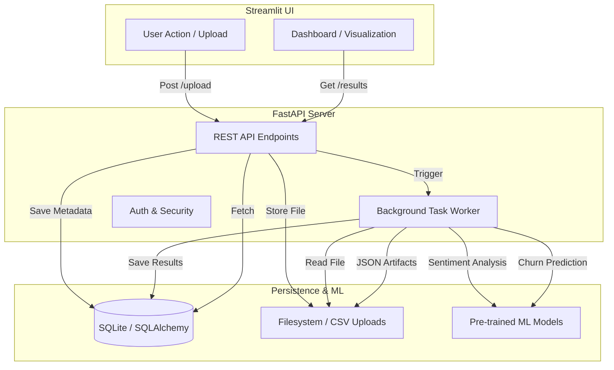

# ICFA: Intelligent Customer Feedback Analyzer - Documentation

The **Intelligent Customer Feedback Analyzer (ICFA)** is a full-stack solution designed to automate the process of analyzing large-scale customer feedback and predicting customer churn. By combining modern web technologies with machine learning, ICFA provides actionable insights for businesses to improve customer retention.

---

## 1. Project Overview

### What the System Does
ICFA is a centralized platform where businesses can upload customer datasets (feedback and usage data) to extract meaningful insights. It processes raw data to identify sentiment patterns, extract key themes, and predict which customers are at risk of leaving (churning).

### Problem it Solves
- **Information Overload**: Manual analysis of thousands of customer reviews is impossible for human teams.
- **Proactive Retention**: Traditional feedback analysis is reactive; ICFA uses predictive modeling to identify churn risk *before* it happens.
- **Workflow Efficiency**: Consolidates ingestion, analysis, and reporting into a single automated pipeline.

### Key Features
- **Secure Authentication**: JWT-based user accounts with security-question-based password resets.
- **Case Management**: Organize datasets into "Cases" for asynchronous processing.
- **Sentiment Analysis**: Automated sentiment scoring (Positive, Negative, Neutral) using the VADER model.
- **Image-to-CSV OCR**: Advanced Optical Character Recognition to extract feedback and churn data from screenshots and paper scans.
- **Handwriting Support**: Intelligent pre-processing to recognize handwritten customer feedback from mobile photos or scanned cards.
- **Keyword Extraction**: Discovery of trending topics using Frequency and TF-IDF analysis.
- **Churn Prediction**: Supervised machine learning to estimate churn probability for individual customers.
- **Interactive KPI Dashboard**: Real-time status monitoring and visual reporting.

---

## 2. Tech Stack

### Languages & Core Frameworks
- **Backend**: Python 3.x (FastAPI) — *High-performance asynchronous API framework.*
- **Frontend**: Streamlit — *Rapid prototyping framework for data applications.*
- **Database**: SQLite (SQLAlchemy ORM) — *Lightweight, serverless relational database.*

### Machine Learning & Data Processing
- **NLP**: `nltk` (VADER), `scikit-learn` (TF-IDF).
- **ML Modeling**: `scikit-learn`, `joblib` (Model persistence).
- **OCR Engine**: `EasyOCR` — *Deep learning based multi-lingual text extraction.*
- **Image Processing**: `OpenCV`, `Pillow` — *Professional-grade cleaning, deskewing, and binarization.*
- **Data Analysis**: `pandas`, `numpy`.
- **Visualization**: `matplotlib`, `plotly` (via Streamlit).

### Security & DevOps
- **Authentication**: `bcrypt` (Hashing), `jose` (JWT), `passlib`.
- **Server**: `uvicorn` (ASGI implementation).
- **Environment Management**: `python-dotenv`.

---

## 3. System Architecture

ICFA uses a decoupled architecture where the Frontend communicates with the Backend via a RESTful API.

### High-Level Flow
1. **Ingestion**: User uploads a CSV, XLSX, PNG, or JPG file.
2. **Pre-processing (For Images)**:
   - **Clean**: OpenCV handles deskewing (straightening) and binarization.
   - **Extract**: EasyOCR transcribes text and clusters it into structured tables.
   - **Munge**: Fuzzy logic maps detected headers (e.g., "usr") to system columns ("User").
3. **Persistence**: Backend saves the processed file and queues a Background Task.
4. **Processing**:
   - **Scenario A (Sentiment)**: The system cleans text (including OCR typo-correction), calculates sentiment, and extracts keywords.
   - **Scenario B (Churn)**: The system preprocesses features and runs the Random Forest model.
5. **Reporting**: Results are stored as JSON and visualized on the dashboard.

### Component Interaction (Mermaid Diagram)



---

## 4. Folder Structure Explanation

| Folder | Purpose |
| :--- | :--- |
| `backend/` | Contains all server-side logic, API definition, and business utilities. |
| `frontend/` | Streamlit application code, including UI pages and navigation logic. |
| `ml/` | Pre-trained model artifacts (`.pkl`) and scripts used for model training. |
| `data/` | Directory for keeping sample datasets and SQLite database files. |
| `scripts/` | One-off maintenance scripts (e.g., database migration tools). |
| `tests/` | Comprehensive test suite for backend, ML, and integration layers. |
| `uploads/` | Storage for uploaded CSV files and generated analysis results JSON. |

---

## 5. File-Level Documentation

### **Backend Core (`/backend`)**
- **`main.py`**: The entry point. Initializes FastAPI, CORS middleware, and mounts routers.
- **`auth.py`**: Handles user registration, login, and secure password reset workflows using JWT.
- **`database/db.py`**: Configures SQLAlchemy engine and session factory.
- **`database/models.py`**: Defines Schema for `User`, `Dataset`, `Feedback`, and `ChurnPrediction`.
- **`routes/ingest.py`**: Manages the upload pipeline and asynchronous background workers for analysis.
- **`utils/sentiment.py`**: NLP logic using NLTK VADER (with OCR typo correction) and TF-IDF keyword extraction.
- **`utils/churn_model.py`**: Logic for loading the churn model, validating CSV schemas, and running inference.
- **`utils/ocr.py`**: Professional OCR pipeline with image cleaning, proximity-based row/column clustering, and fuzzy header mapping.

### **Frontend UI (`/frontend`)**
- **`app.py`**: Main Streamlit entry point. Manages session state and page routing.
- **`login.py` / `register.py`**: Modular UI components for authentication.
- **`pages/dashboard.py`**: The home view containing global KPIs and the database case manager.
- **`pages/ingestion.py`**: The interface for uploading and partitioning data.
- **`pages/feedback_page.py`**: Visualizations for sentiment analysis results.
- **`pages/churn_page.py`**: Visualizations for customer churn probability clusters.

---

## 6. API Documentation

### **Authentication (`/auth`)**
- `POST /auth/register`: Create a new account.
- `POST /auth/login`: Authenticate and receive a JWT.
- `POST /auth/forgot-password`: Retrieve the security question for a user.
- `POST /auth/verify-security-answer`: Exchange an answer for a temporary reset token.
- `POST /auth/reset-password`: Update password using the reset token.

### **Ingestion (`/ingest`)**
- `POST /ingest/upload`: Upload a CSV and trigger background processing (FormData).
- `GET /ingest/cases/{username}`: List all analysis cases for a specific user.
- `GET /ingest/results/{case_id}`: Retrieve full analysis results (Sentiment or Churn).
- `DELETE /ingest/cases/{case_id}`: Remove a case and its associated data.
- `POST /ingest/cases/{case_id}/retry`: Re-trigger processing for a stalled or failed case.

---

## 7. Setup Instructions

### **1. Environment Preparation**
Ensure you have Python 3.9+ installed. It is recommended to use a virtual environment.
```bash
python -m venv venv
source venv/Scripts/activate  # Windows
```

### **2. Installation**
Install all required dependencies:
```bash
pip install -r requirements.txt
```

### **3. Database Migration**
If starting with a fresh environment, initialize the database columns:
```bash
python tools/migrate_hashes.py
```

### **4. Running the Services**
You must run both the backend and the frontend in separate terminals.

**Terminal 1 (Backend):**
```bash
uvicorn backend.main:app --reload
```

**Terminal 2 (Frontend):**
```bash
streamlit run frontend/app.py
```

---

## 8. Improvements

### **Scalability Suggestions**
- **Task Queue**: Move from FastAPI `BackgroundTasks` to **Celery + Redis** for distributed processing of large (1M+ row) datasets.
- **Storage**: Migrate from SQLite to **PostgreSQL** to handle concurrent database writes more effectively.
- **Object Storage**: Store CSV uploads in **AWS S3** instead of the local filesystem for better persistence.

### **Code Quality Improvements**
- **Global Error Handling**: Implement a centralized FastAPI Exception Handler to standardize API error responses.
- **Pydantic Schemas**: Move all request/response models from inline definitions to a dedicated `schemas/` directory.
- **Testing**: Expand unit tests for ML utilities to detect data drift and performance regressions.
